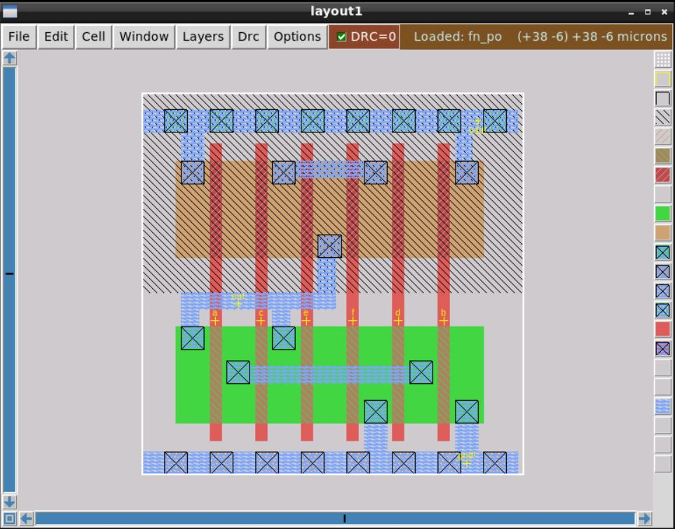
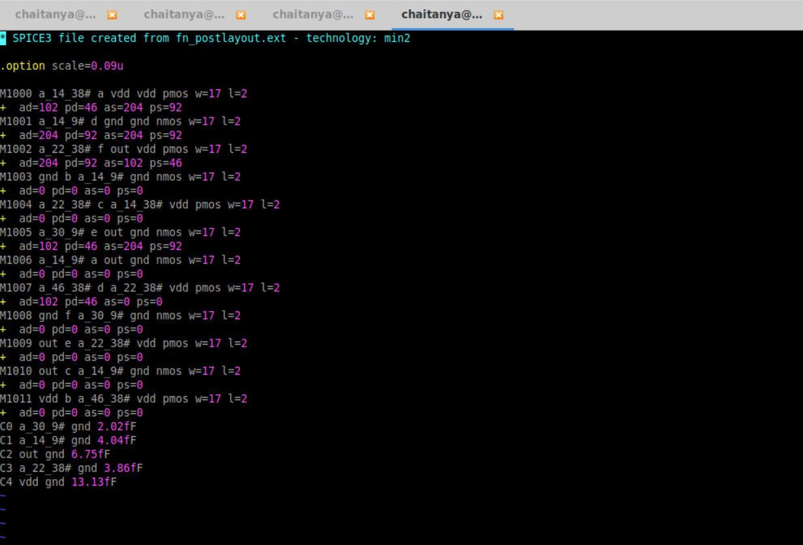
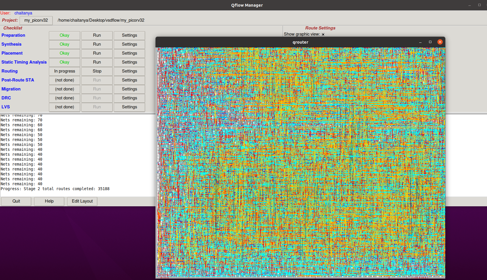
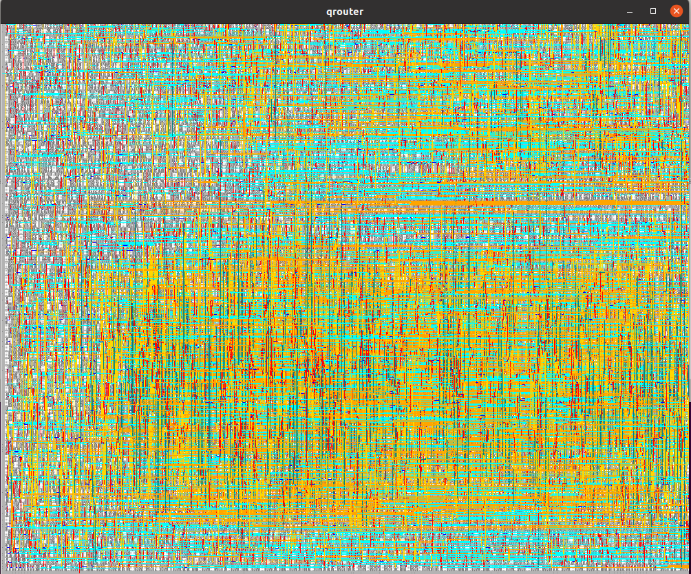

# PHYSICAL-DESIGN-Workshop
A very useful and informative workshop, where i have gained hands on experience on physical design tools like opentimer, ngspice , magic and sta. It hepled me to understand the flow of design from RTL file to GDSII on tsmc 180nm technology. From this workshop I learnt about SPEF "IEEE 1481-1999" standard,LEF, DEF, SDC files and their significance in the Design flow. Tools used are NGSPICE, MAGIC LAYOUT tool, YOSYS- logic synthesis, GRAYWOLF- placement, QROUTE- maze routing, OPENSTA- timing analysis and SPEF extractor.

## 1.Introduction to RISC-V and SoC
    
   a)Description about Fundamentals of PCB and Chip Design.
    
   b)Fundamentals of Packages, PADS, Core and ICs.
    
   c)Introduction to RISC-V architecture.
    
   d)SoC brief taking an Raven chip model with internal explaination about SRAM, ADCs and other Analog IPs.
    
   e) Introduction on design flow and tools on which the design has to be implemented with a goal of processing RTL to GDSII. Tools like 
    
       YOSYS- Logic synthesis
       GREYWOLF- Placement 
       QROUTER- routing
       OPEN_TIMER- Static timing analysis
       MAGIC - layout viewer
       eSPICE - For SPICE simulations with schematically capturing the responses and functionality.
       Qflow - It is provided in order to ease the total design process for complete flow of RTL to GDSII 
       
   f) Invoked the flow using  below git clone for vsdflow : 
            
             git clone https://github.com/kunalg123/vsdflow.git
             
 
 
   g) VSDFLOW is scripted for SPI_SLAVE, using below commands spi_slave related files are generated which includes output files also.
        
             cd vsdflow
             ./vsdflow spi_slave_design_details.csv
             ls -ltr outdir_spi_slave/
             
   
        
  output files will be generated in below folder:
             
             cd outdir_spi_slave
         
  For viewing the layout of spi_slave below command is entered in terminal
             
             qflow display spi_slave
  
  
  
  
   h) In order to do synthesis for picorv32 few commands are entered in the terminal which results in the displaying 
    he number of gates, DFFs and other std_cells
    
  
  
  
  
## 2.SYNTHESIS AND PLACEMENT
        
   Definition of width and height of die, core which depends on standard cell dimensions. 
   Core internally consists of many standard cells placed properly with proper intensity, aspect ratio, utilisation factor
   and also location of pre placed cells.
        
   These pre placed cells with suitable decoupling capacitors with consideration of noise margin concept.
 
   The decoupling capacitors are of huge value which are placed between Vdd and Vss.
 
   Proper power planning is done in order to avoid IR drop and Ground Bounce.
 
        cd
        cd vsdflow
        mkdir my_picorv32
        cd my_picorv32
        mkdir source synthesis layout
        cp ~/vsdflow/verilog/picorv32.v source/.
        qflow gui &
        
        In GUI these below settings are made in order to do synthesis and placement:
        
        Technology = osu018
        Verilog source file : picorv32.v
        Verilog module : picorv32
        
   **GUI**
 
 
 
   **Synthesis Run**
  
 
   
   **PLACEMENT_RUN**
 
 
## 3.NGSPICE & MAGIC TOOLS
 
   Mainly focused on the characterisation and design of basic cells using tools like NGSPICE and MAGIC LAYOUT.
   
   For this the static and dynamic behavioural responses of the CMOS inverter is studied with switching threshold,
   propagation delay and also slew rate.
      
   In order to do efficient layout Euler's method is used and then implemented on stick diagram(Euler's path). This method gives optimised
   metal connections and wirings.
   
   This stick diagram gives abstract layout using which the real layout is done on MAGIC tool using all the available templates like different metals
   n-diffuse, p-diffuse, n-subcontact, p-subcontact, polysilicon etc.
      
   Inverter characterisation is using the ngspice file using below commands. By resizing the PMOS the characteristics are observed
   
            cd 
            git clone https://github.com/kunalg123/ngspice_labs.git
            cd ngspice_labs
            cat inv_spice
            ngspice inv.spice
            ngspice 1-> run
      
   Inverter Transient response:
   
  
  
            ngspice inv_tran.spice
            ngspice 1-> run
  
  
 
   Response of the inverter spice simulation:
   
  
  
   Response of the inverter spice simulation with change in PMOS width hence leads to change in Vt and also rise delay:
   
  
  
  
  
  An combinational circuit's boolean expression is taken as example for layout. Behavioural response is taken from the spice netlist of prelayout
  and after layout is done, parasitic capacitance is extracted from layout, converted to spice netlist
  and postlayout response is taken by using below commands:
  
        cd ngspice_labs
        magic -T min2.tech fn_postlayout.mag &
 
        
 
 
 
  
  
## 4.Timing Analysis

   Timing analysis is done with ideal clock and real clock. Clock tree synthesis is done using H-tree approach by taking midpoints 
   to derive clock.
   Buffers can be introduced if H-tree approach is not provided.
   Tools are used to analyze provided .lib file and file path is given below:
   
            /usr/local/share/qflow/tech/osu018/osu018_stdcells.lib
            
   Timing analysis is done for picorv32 by creating sdc file - picorv32.sdc
            
            cd vsdflow/my_picorv32
            leafpad picorv32.sdc
            
   In sdc file by creating a clk in the file :
            
            create_clock -name clk -period 2.5 -waveform {0 1.25} [get_ports clk]
   
   For prelayout, creating sta config file:
   
            leafpad prelayout_sta.conf
            
   Giving inputs in the file .conf file and save
            
            read_liberty /usr/local/share/qflow/tech/osu018/osu018_stdcells.lib
            read_verilog synthesis/picorv32.rtlnopwr.v
            link_design picorv32
            read_sdc picorv32.sdc
            %
            report_checks
            
   Slack can be viewed by using below command in above - %
   
            report_checks -digits 6
            
   
  

## 5.ROUTING

      
   Routing is done using Maze type Lee's algorithm in which grid is routed. This is done from driver to load.
   DRC violations has to checked and resolved with clean DRC=0.
   SPEF extraction is done with IEEE industrial standards "IEEE 1481 -1999".
   Routing process is done by using below commands:
   
            cd vsdflow/my_picorv32
            qflow route picorv32
            qflow sta picorv32
            qflow backanno picorv32
            leafpad log/sta.log
            
   
   
   
            
   Timing analysis is made for prelayout and also postlayout through which the max clock frequency drop is observed.
   Prelayout frequency comes to 316MHz and postlayout frequency drops to 290MHz.
   
   For postlayout sta:
   
            log/post_sta.log
   
   
   
## 6.ACKNOWLEDGEMENT

      
   My sincere thanks to Kunal Gosh( Co-Founder -VSD Corp. PVT Ltd ) sir in helping to gain very good knowledge on Physical design tools which boosts
   my career in VLSI domain.
  
  
 
